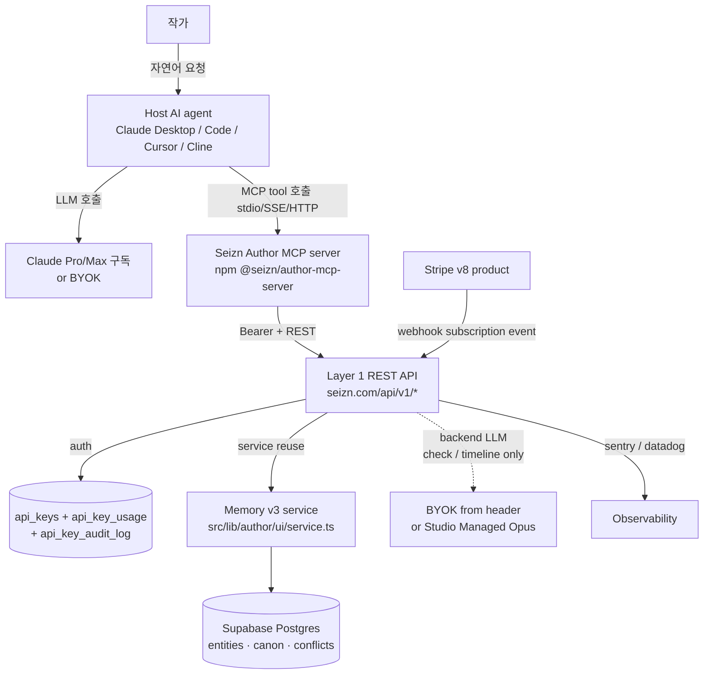

# Seizn Author Track 2 — Phase 0 Task Pack (Platform: API + MCP)

**Date:** 2026-05-06
**Track:** 2 (API + MCP + SDK)
**Phase:** 0 (Layer 1 API foundation + key issuance + Stripe v8 setup + public docs + MCP publish prep)
**Status:** Ready for build agent dispatch

**Source design doc:** `docs/architecture/seizn-author-track-2-platform-2026-05-05.md`
**Pricing memory (v8 lock):** `seizn-author-pricing-2026-05.md`
**3-track architecture:** `seizn-author-three-track-architecture.md`

---

## Open decisions (build 시작 전 사용자 승인 필수 — 28개 보강 후 lock)

**LOCKED 2026-05-06 (사용자 confirm).** 권장 그대로 진행.

| # | 결정 | Lock |
|---|---|---|
| 1 | BYOK key 저장 위치 | **(a) Per-request header `X-LLM-Key`** — Phase 0~7 적용. server 저장 X. Vault (옵션 b) 는 Phase 8+ 별 cycle |
| 2 | Multi-tenancy (Studio 5 seats) | **(a) v1 = 1 user 1 key** — Studio = 5 keys per user. 진짜 multi-seat (`org_id` + `org_members`) 는 B2B 출판사 contract 시 별 cycle |
| 3 | v7 → v8 Stripe cutover | **PR merge 즉시 v7 SKU 제거** (신규 차단). 기존 v7 결제자 = **90일 grandfather**. **91일째 v8 자동 마이그레이션 안내 메일 발송**. v7 결제자 0 명일 시 grandfather skip (Stripe dashboard 사용자 영역 verify) |

원본 옵션 분석 (참고용 — lock 후에도 future cycle 에서 정책 변경 시 reference):

1. **BYOK Anthropic/OpenAI key 저장 위치** (Phase 1·2 영향):
   - (a) Per-request header — 매 호출마다 client 가 `X-LLM-Key` header 로 전달. 우리 server 는 저장 X. 단순·보안 강함·UX 마찰
   - (b) Server-side encrypted vault — user account 에 encrypted 저장 (AES-256-GCM + per-org KEK). UX 좋음·보안 책임 우리·복잡
2. **Multi-tenancy (Studio tier 5 seats)** (Phase 0 schema 영향):
   - (a) v1 = 1 user 1 key — Studio 5 seats 는 Phase 8+ 별 cycle 로 deferred
   - (b) v1 = `org_id` + `org_members` 테이블 처음부터 — schema 복잡·DB migration 큼
3. **v7 → v8 Stripe cutover 시점**:
   - 실제 v7 결제자 수 검증 — Stripe dashboard 확인 (사용자 영역). 0 명일 시 grandfather skip.

dispatch 시 codex 는 이 3건 lock 그대로 진행. 추가 stop and ask 불필요.

---

## Architecture diagram (mermaid, reference)



**3 layer 분리:**
- **Layer 0 — Host LLM** (사용자 책임, 우리 무관)
- **Layer 1 — REST API** (Bearer auth, rate limit, quota, no-LLM 도구는 BYOK 불필요)
- **Layer 2 — MCP server** (npm package, Layer 1 호출, sdio/SSE/HTTP 3가지 transport)

---

## How to use this document

자동 순차 진행 모드. 단일 Codex run 으로 Phase 0~7 (코드 작업 전체) 를 연달아 실행. Phase 8 은 수동 (Stripe v8 product 활성화 + npm publish + production deploy 후 사용자 승인).

각 phase:

1. Phase 섹션 read.
2. Steps 실행.
3. Verify gate 평가.
4. **Gate pass → 즉시 다음 phase 진입.** 보고 없이 진행.
5. **Gate fail → 즉시 stop, 실패 내용 보고, Phase 7 완료까지 자동 진행 중단.**
6. Phase 7 완료 → 자동 stop (Phase 8 은 사용자 영역).

병렬 금지 — 항상 sequential. cross-task 오염 방지.

verify gate 가 안전망. 실패하지 않은 phase 는 묻지 않고 진행.

### Dispatch header (단 1회)

```text
작업 디렉토리: C:/Users/admin/Projects/seizn
실행 대상: C:/Users/admin/Projects/seizn/docs/architecture/seizn-author-track-2-phase-0-task-pack-2026-05-06.md §Phase 0 → §Phase 7 순차 자동
지침: Phase 0부터 시작. 각 phase verify gate 통과 시 다음 phase 즉시 진입.
      verify gate 실패 시 즉시 stop, 실패 phase·gate·로그 보고.
      Phase 7 완료 후 자동 stop (Phase 8 = Stripe v8 activation + npm publish + production deploy 는 인간 작업).
      병렬 실행 금지·순차만 (feedback_codex_sequential_execution 정합).
      각 phase 의 commit 양식 준수. 한 phase = 정해진 commit 단위.
      Track 1 (Web Dashboard) 의 dashboard redesign 코드 (PR #246~#251 결과) 수정 금지.
      Track 3 (`seizn-desktop/*`) 영역 침범 금지.
      Memory v3 service / store / supabase-store 내부 수정 금지.
      Engine NPC SDK 영역 (`engine.seizn.com`, `src/app/engine/*`) 침범 금지.
      KNOT 식별자 (char.sori · knot.short1 · 청학여 등) 노출 금지 — Saebyeok IP만.
      공개 텍스트에 큰따옴표 금지 (작은따옴표만).
      v7 Stripe product 직접 deactivate 금지 — Phase 4 spec 만, 실 Stripe API 호출은 Phase 8 인간 작업.
```

---

## Pre-flight checklist

Phase 0 시작 전 확인:

- [ ] `git status` clean (uncommitted changes 없음, 또는 cycle 이전 변경 정리됨)
- [ ] `git fetch origin main && git checkout -b feat/track-2-phase-0 origin/main` 으로 새 브랜치
- [ ] `pnpm install` 한 번 (이미 packages/author-mcp-server scaffold 후 install 완료 가정)
- [ ] `git config user.name` = `litheonhq`, `git config user.email` = `litheonhq@gmail.com`
- [ ] 메모리 `seizn-author-pricing-2026-05.md` v8 lock 확인 (가격 정합)
- [ ] 메모리 `seizn-author-three-track-architecture.md` 확인 (작업 위치 정합)
- [ ] `packages/author-mcp-server/` scaffold 존재 + `pnpm --filter @seizn/author-mcp-server build` pass
- [ ] **Open decisions §1~3 lock 됨** (BYOK 저장 / multi-tenancy / v7 cutover) — 사용자 승인 받은 상태
- [ ] **production env 변수 준비 확인** (Phase 8 인간 작업 전 필요):
  - `UPSTASH_REDIS_REST_URL` + `UPSTASH_REDIS_REST_TOKEN` (Phase 1 rate limit)
  - `STRIPE_SECRET_KEY` + `STRIPE_WEBHOOK_SECRET` (Phase 3, 이미 있을 가능성)
  - `STRIPE_PRICE_LOCK_VERSION=v8` (Phase 3 cutover)
  - `SENTRY_DSN` 또는 `DATADOG_API_KEY` (Phase 7 observability, optional v1)
  - `TRACK_2_API_ENABLED` (feature flag, default `false`, Phase 8 에서 점진 rollout)
- [ ] **Stripe v7 결제자 수 확인** (Phase 3 cutover 정책 정합) — Stripe dashboard `Customers > active subscriptions on v7 products` 카운트
- [ ] **`pgcrypto` Postgres extension 활성화 가능 확인** (Supabase 는 default 활성)

---

## Phase 0 — Database schema (api_keys + api_key_usage + audit_log + multi-tenancy ready)

**Goal:** API key 인증 + per-key quota tracking + audit trail + (deferred) multi-tenancy 의 DB 토대 구축.

**Open decisions impact:**
- §1 BYOK 저장 = (a) per-request header 권장 → vault 테이블 신설 X (Phase 8+ deferred)
- §2 Multi-tenancy = (a) v1 deferred 권장 → `org_id` column 만 nullable 로 추가 (future migration cost ↓)

**Steps:**

1. 기존 Supabase migration 디렉토리 위치 확인: `supabase/migrations/`.
2. 신규 migration 파일 생성: `supabase/migrations/<timestamp>_track_2_api_keys.sql`.
3. 다음 SQL 적용 (pgcrypto extension 보장 + 3 테이블 + index + RLS + audit trigger):

```sql
-- pgcrypto for gen_random_uuid()
create extension if not exists pgcrypto;

-- API keys (per-user, future: per-org via org_id)
create table public.api_keys (
  id uuid primary key default gen_random_uuid(),
  user_id uuid not null references auth.users(id) on delete cascade,
  org_id uuid,                              -- nullable v1; multi-tenancy 활성화 시 NOT NULL migration
  prefix text not null,                     -- 'sk_seizn_' + 8 char id (display)
  hash text not null,                       -- SHA-256 hash hex of full key (NOT bcrypt - perf)
  name text not null,                       -- user-provided label
  scopes text[] not null default array['recall','remember','graph','search']::text[],
  rate_limit_per_minute int not null default 30,
  monthly_quota int not null default 100,   -- per pricing tier (Free=100/day, Indie=1k/mo, ...)
  monthly_quota_period text not null default 'month' check (monthly_quota_period in ('day','month')),
  last_used_at timestamptz,
  created_at timestamptz not null default now(),
  revoked_at timestamptz,
  rotated_from_id uuid references public.api_keys(id)  -- key rotation chain
);

-- usage events with LLM cost tracking (밀리달러 정수 단위로 부동소수점 회피)
create table public.api_key_usage (
  id bigserial primary key,
  api_key_id uuid not null references public.api_keys(id) on delete cascade,
  tool text not null,                       -- 'recall' | 'check' | 'remember' | 'search' | 'timeline' | 'graph'
  project_id uuid,
  cost_units int not null default 1,        -- quota 차감 단위 (recall=1, check=5, timeline=5)
  llm_cost_usd_milli int not null default 0,  -- 실제 LLM cost (밀리달러 정수, AI-enhanced 도구만)
  llm_provider text,                        -- 'anthropic' | 'openai' | null
  llm_model text,                           -- 'claude-sonnet-4-7' | 'claude-opus-4-7' | null
  occurred_at timestamptz not null default now()
);

-- audit trail (Studio tier audit log 항목 정합)
create table public.api_key_audit_log (
  id bigserial primary key,
  api_key_id uuid references public.api_keys(id) on delete set null,
  user_id uuid not null references auth.users(id),
  org_id uuid,
  action text not null check (action in ('created','revoked','rotated','rate_limited','quota_exceeded','scope_denied')),
  metadata jsonb not null default '{}'::jsonb,
  occurred_at timestamptz not null default now()
);

-- indexes
create unique index api_keys_prefix_uniq on public.api_keys(prefix) where revoked_at is null;
create index api_keys_user_idx on public.api_keys(user_id) where revoked_at is null;
create index api_keys_org_idx on public.api_keys(org_id) where revoked_at is null;
create index api_key_usage_key_month_idx on public.api_key_usage(api_key_id, occurred_at);
create index api_key_audit_log_user_idx on public.api_key_audit_log(user_id, occurred_at desc);
create index api_key_audit_log_org_idx on public.api_key_audit_log(org_id, occurred_at desc);

-- RLS
alter table public.api_keys enable row level security;
alter table public.api_key_usage enable row level security;
alter table public.api_key_audit_log enable row level security;

create policy "users see own keys" on public.api_keys for select using (auth.uid() = user_id);
create policy "users insert own keys" on public.api_keys for insert with check (auth.uid() = user_id);
create policy "users revoke own keys" on public.api_keys for update using (auth.uid() = user_id) with check (auth.uid() = user_id);
create policy "users see own usage" on public.api_key_usage for select using (
  exists (select 1 from public.api_keys where id = api_key_id and user_id = auth.uid())
);
create policy "users see own audit" on public.api_key_audit_log for select using (auth.uid() = user_id);

-- service role bypass (REST API server uses service role to insert usage/audit on behalf of user)
-- Note: server code must validate api_key first via SHA-256 lookup, then write usage/audit
```

4. Migration 적용: `supabase db push` 또는 `pnpm supabase:migrate` (project-specific script 명).
5. 기존 Memory v3 의 `author_projects` 테이블이 user_id 기반인지 확인 (있으면 cross-reference 위해 schema 일관성 검증, 변경 X).
6. **org_id deferred note** — `docs/billing/multi-tenancy-deferred.md` 신규 1줄 doc:
   > Multi-tenancy (Studio tier 5 seats real impl) deferred to Phase 8+ cycle. v1 = `api_keys.org_id` nullable, Studio = '1 user, 5 keys per user' 운용.

**Verify gate:**
- `supabase db diff` 가 3 신규 테이블 + 6 인덱스 + RLS policy 인식
- `pnpm typecheck` pass (DB type 자동 생성 시)
- `pnpm test` pass (기존 테스트 영향 X 확인)
- `psql -c "select * from pg_extension where extname='pgcrypto'"` = 1 row (extension 활성)

**Commit:**

```text
feat(track-2): add api_keys + api_key_usage + api_key_audit_log tables (multi-tenancy ready, SHA-256 hash)
```

**Verify gate pass → Phase 1 자동 진행. Fail → stop and report.**

---

## Phase 1 — API key 발급 service (generate, hash, validate, rate-limit, quota, audit)

**Goal:** API key 생성·검증·rate limit·quota·audit 의 server-side service. **Hash = SHA-256 (bcrypt 아님 — 성능 critical)**.

**Steps:**

1. `src/lib/api-keys/` 디렉토리 신설.
2. `src/lib/api-keys/generate.ts`:
   - `generateApiKey()`: prefix `sk_seizn_` + 8 char display id + `_` + `crypto.randomBytes(32).toString('base64url')` = 약 60 char
     - 예: `sk_seizn_a1b2c3d4_xK7n9pQrS...` (display id 가 prefix 의 unique part, full 검증은 hash 비교)
   - `hashApiKey(key: string)`: `crypto.createHash('sha256').update(key).digest('hex')` (rounds X, 매 request <1ms)
   - `extractPrefix(key: string)`: `sk_seizn_<8char>` substring (DB lookup key)
   - `formatDisplay(key: string)`: 'sk_seizn_abc12345...xyz' (앞 17 + last 3)
   - **Why SHA-256 over bcrypt:** API key 는 high-entropy random (256 bit), KDF 불필요. bcrypt rounds 12 = 50~200ms × API hot path = 성능 critical. Stripe / GitHub 패턴 정합.
3. `src/lib/api-keys/validate.ts`:
   - `validateBearer(token: string)`:
     1. prefix extract → DB lookup `where prefix=$1 and revoked_at is null` (unique index 활용)
     2. SHA-256 hash 계산 → `crypto.timingSafeEqual` 로 stored hash 와 비교 (timing attack 방어)
     3. return `{ apiKeyId, userId, orgId, scopes, rateLimitPerMinute, monthlyQuota, monthlyQuotaPeriod }` 또는 throw `InvalidApiKeyError`
     4. async fire-and-forget update `last_used_at = now()` (await X — hot path 영향 X)
   - `checkScope(scopes: string[], required: string)`: scope check, fail 시 audit log `scope_denied` insert
4. `src/lib/api-keys/rate-limit.ts`:
   - `checkRateLimit(apiKeyId: string, perMinute: number)`: Upstash Redis token bucket
   - 환경변수 `UPSTASH_REDIS_REST_URL` + `UPSTASH_REDIS_REST_TOKEN` **production 필수** (없으면 process startup fail with clear error: 'Track 2 API requires Upstash Redis. See docs/architecture/seizn-author-track-2-phase-0-task-pack §Pre-flight')
   - dev environment 만 in-memory fallback (env `NODE_ENV=development` 명시 필요)
   - rate limit 초과 시 audit log `rate_limited` insert (async)
5. `src/lib/api-keys/quota.ts`:
   - `recordUsage(apiKeyId, tool, projectId, costUnits, llmCost?, llmProvider?, llmModel?)`: insert into api_key_usage (Phase 0 schema 의 llm_cost_usd_milli 활용)
   - `getMonthlyUsage(apiKeyId)`: aggregate sum of cost_units this calendar month — **Redis cached counter** (월말 reset, ttl 31일) 우선, miss 시 DB fallback aggregate
   - `enforceQuota(apiKeyId, monthlyQuota, period: 'day' | 'month')`: Free tier 는 daily (period='day') 처리
   - quota 초과 시 audit log `quota_exceeded` insert + return 402 Payment Required hint
6. `src/lib/api-keys/rotate.ts` (선택, but 메모리 권장):
   - `rotateApiKey(oldKeyId)`: 기존 key revoke + 신규 key generate + `rotated_from_id` 연결
   - 90일 unused key 자동 revoke 정책 = Phase 8+ cron job (이 phase 에서 helper 만 작성)
7. `src/lib/api-keys/audit.ts`:
   - `recordAudit(apiKeyId, userId, orgId, action, metadata)`: insert into api_key_audit_log
   - 모든 critical action (created/revoked/rotated/rate_limited/quota_exceeded/scope_denied) 자동 호출
8. 단위 테스트: `src/lib/api-keys/__tests__/`
   - generate roundtrip (generate → hash → validate)
   - timing-safe compare (잘못된 key 와 valid key 의 비교 시간 동일 ±5ms)
   - rate limit (30 req in 60s pass, 31st fail) — Free tier default
   - quota (Free 100/day pass, 101st fail with 402)
   - rotation (rotate → old revoked + new active + rotated_from_id 연결)
   - audit log (모든 action 이 audit table 에 기록)

**Verify gate:**

- `pnpm test src/lib/api-keys` pass (모든 단위 테스트 + timing-safe property)
- `pnpm typecheck` pass
- `pnpm lint` pass
- production env 부재 시 startup fail 검증 (`UPSTASH_REDIS_REST_URL=` 없이 `NODE_ENV=production pnpm dev` → process 종료)

**Commit:**

```text
feat(track-2): add api-keys service (SHA-256 hash, timing-safe validate, Upstash rate-limit, quota, audit, rotation)
```

**Verify gate pass → Phase 2 자동 진행. Fail → stop and report.**

---

## Phase 2 — Layer 1 REST API endpoint 구현 (`/api/v1/*`)

**Goal:** Memory v3 의 핵심 기능을 외부 노출. Bearer auth + rate limit + quota + idempotency + pagination + CORS + RFC 7807 error.

**Steps:**

1. `src/app/api/v1/` 디렉토리 신설.
2. 공통 미들웨어: `src/lib/api-v1/middleware.ts`:
   - `withApiKey(handler, requiredScope?)`: Bearer token parse → validate → scope check → rate limit → quota check → inject `{ userId, orgId, apiKey }` into handler
   - `withLlmKey(handler)` (AI-enhanced 도구만, check + timeline): `X-LLM-Provider` + `X-LLM-Key` header 추출 → handler 에 inject. 부재 시 `precondition_required` 402 fallback ('Studio Managed 가입 또는 BYOK header 추가하세요')
   - `withIdempotency(handler)` (POST 만): `Idempotency-Key` header 처리, Redis cache 24h. 동일 key 재호출 시 cached response 반환 (Stripe 패턴)
   - `withErrorHandling(handler)`: catch + RFC 7807 problem+json schema 변환:

     ```json
     {
       "type": "https://seizn.com/errors/quota-exceeded",
       "title": "Monthly quota exceeded",
       "status": 402,
       "code": "quota_exceeded",
       "detail": "API key sk_seizn_a1b2c3d4 reached 1000 calls this month. Upgrade plan or wait for reset.",
       "instance": "/api/v1/projects/abc/recall",
       "request_id": "req_x7n9..."
     }
     ```

   - `withCors(handler)`: `Access-Control-Allow-Origin: *` (또는 user-configurable allowlist), `Allow-Methods: GET,POST,OPTIONS`, `Allow-Headers: authorization,content-type,idempotency-key,x-llm-provider,x-llm-key`. Preflight `OPTIONS` 자동 처리
   - `withRequestId(handler)`: `request_id = crypto.randomUUID()`, response header `X-Request-Id` 노출, observability 정합

3. 8개 endpoint 구현 (각각 Memory v3 service reuse):

```text
src/app/api/v1/projects/route.ts                      GET (list) + POST (create)
src/app/api/v1/projects/[id]/recall/route.ts          GET
src/app/api/v1/projects/[id]/recall/[entityId]/mentions/route.ts  GET
src/app/api/v1/projects/[id]/conflicts/check/route.ts POST
src/app/api/v1/projects/[id]/canon/[entityId]/approve/route.ts POST
src/app/api/v1/projects/[id]/search/route.ts          GET
src/app/api/v1/projects/[id]/timeline/route.ts        GET
src/app/api/v1/projects/[id]/graph/route.ts           GET
src/app/api/v1/usage/route.ts                          GET (current quota usage)
```

4. **Pagination** (cursor-based, Stripe 패턴):
   - 적용 endpoint: `mentions`, `timeline`, `search` (결과 큰 list)
   - query params: `?starting_after=<id>&limit=<n>` (default limit 20, max 100)
   - response shape: `{ data: [...], has_more: boolean, next_starting_after?: string }`
5. 각 endpoint 의 cost_units + LLM 정합 (Phase 1 quota + LLM cost 추적):

| Endpoint | cost_units | Backend LLM | BYOK 필요? |
|---|---|---|---|
| `GET /projects` | 0 | ❌ | ❌ |
| `POST /projects` | 1 | ❌ | ❌ |
| `GET /recall` | 1 | ❌ | ❌ |
| `GET /recall/{eid}/mentions` | 1 | ❌ | ❌ |
| `POST /conflicts/check` | 5 | ✅ Sonnet | ✅ (or Studio Managed) |
| `POST /canon/{eid}/approve` | 1 | ❌ | ❌ |
| `GET /search` | 2 | ⚠️ embedding only | ❌ (우리 부담) |
| `GET /timeline` | 5 | ✅ Sonnet | ✅ (or Studio Managed) |
| `GET /graph` | 1 | ❌ | ❌ |
| `GET /usage` | 0 | ❌ | ❌ |

6. response 타입: `packages/author-mcp-server/src/api-client.ts` 의 type 정의와 1:1 매핑 — 변경 시 mcp-server type 도 동시 갱신.
7. **Versioning + deprecation**: 모든 response header `Seizn-Api-Version: 1.0`. Future deprecation 시 `Deprecation: <date>` + `Sunset: <date>` header 추가. v2 launch 6개월 후 v1 sunset.
8. e2e 테스트: `src/app/api/v1/__tests__/`
   - 유효 key + recall 호출 → 200 + entity list + `X-Request-Id` header
   - 무효 key → 401 + RFC 7807 error
   - 만료 key (revoked_at set) → 401 + audit log `scope_denied` 기록
   - scope 부족 (recall scope 만 있는 key 가 check 호출) → 403 + audit log
   - rate limit 초과 → 429 + `Retry-After` header + audit log
   - 월 quota 초과 → 402 Payment Required + audit log
   - check endpoint w/o BYOK header (Free/Indie/Pro/Studio plan) → 402 `precondition_required`
   - check endpoint w/ BYOK header → 200, llm_cost_usd_milli 기록
   - Idempotency-Key 중복 → 동일 response (DB 중복 insert X)
   - cursor pagination (mentions 25개 → limit=10 → 3 페이지 fetch → 동일 25개)
   - CORS preflight (OPTIONS /api/v1/projects/test/recall) → 204 + headers

**Verify gate:**

- `pnpm test src/app/api/v1` pass (모든 e2e 시나리오)
- `pnpm typecheck` pass
- `pnpm lint` pass
- 수동 curl 테스트:

  ```bash
  curl -H 'authorization: Bearer sk_seizn_test_...' \
       -H 'idempotency-key: test-001' \
       http://localhost:3000/api/v1/projects/test-project/recall?q=Seoyun
  # → 200 + JSON body + X-Request-Id header
  ```

- mcp-server type 정합: `pnpm --filter @seizn/author-mcp-server typecheck` pass (response shape 일치 확인)

**Commit:**

```text
feat(track-2): add public REST API at /api/v1/* (10 endpoints, Bearer + scope + idempotency + cursor pagination + CORS + RFC 7807 errors)
```

**Verify gate pass → Phase 3 자동 진행. Fail → stop and report.**

---

## Phase 3 — Stripe v8 product spec 작성 (Track 2 채널 한정, 실 등록은 Phase 8)

**Goal:** v8 가격 (Free / Indie $9 / Pro $19 / Studio $99 / Studio Managed $299 / Enterprise) 의 Stripe product 명세 + v7 deprecate 계획 문서화. **실 Stripe API 호출 X** — 사용자 영역.

**Scope 정합 (master §5.0 + §5.2):**

- 이 Phase 3 의 Stripe product = **Track 2 (API + MCP) 채널 한정**. Track 1 (Web KRW) / Track 3 (Tauri KRW) 의 Stripe product 는 별 트랙 owner session 이 등록.
- 단일 Stripe customer 위에 트랙별 별 subscription 으로 attach. 한 사용자가 Track 1 + Track 2 둘 다 결제 시 한 customer 에 KRW + USD 두 subscription. 인보이스 분리.
- v7 의 5 product (`prod_UNGacXMozktNgE` 등) = 단일 통합 가격 가정으로 등록된 것 → v8 으로 split 시 Track 1/2/3 각자 product 로 재배치. **이 Phase 3 = Track 2 product 만 spec.** Track 1/3 product 는 별 트랙 cycle.

**Steps:**

1. 신규 문서: `docs/billing/stripe-v8-setup.md`:
   - v8 product 정의 5개 (Free 는 Stripe product 없이 plan flag 만; Indie/Pro/Studio/Studio Managed/Enterprise 는 실 product)
   - 각 product 의 monthly + yearly price (예: Indie $9/월 + $90/년)
   - Studio Managed 의 metered overage price ($0.15/Opus call)
   - v7 product (`prod_UNGacXMozktNgE` 등 5개) deprecate 절차:
     - v7 active subscription 보유자 = grandfather (계속 동일 가격으로 청구)
     - v7 신규 가입 차단 = pricing page 에서 v7 SKU 제거
     - v7 product 자체는 archive (activate=false), Stripe 자동으로 신규 결제 차단
   - env 변경: `STRIPE_PRICE_LOCK_VERSION=v8`, `STRIPE_PRICE_ID_INDIE_*`, `STRIPE_PRICE_ID_PRO_*`, ... 신규 ID
2. 신규 코드: `src/lib/billing/v8-products.ts`:
   - typed product catalog (Free / Indie / Pro / Studio / Studio Managed / Enterprise)
   - tier → quota / rate_limit_per_minute / scopes 매핑
   - subscription tier 변경 시 api_keys 의 monthly_quota / rate_limit_per_minute 자동 갱신 helper
3. webhook handler (Phase 1 의 quota 와 연결): `src/app/api/webhooks/stripe/route.ts` 또는 기존 webhook route 갱신:
   - `customer.subscription.created/updated/deleted` 처리 → user_id → api_keys 갱신
   - **신규 product ID 받기 전까지 placeholder env (`STRIPE_PRICE_ID_INDIE_MONTHLY=price_TODO`)** — Phase 8 에 사용자가 실 ID 채움
4. Pricing UI 코드 변경은 별 PR (이 cycle scope 밖, Track 1 영역).
5. v7 deprecate notice: `docs/billing/v7-deprecation-notice.md` — 사용자가 기존 v7 결제자에게 보낼 안내 메일 템플릿 (KR + EN).

**Verify gate:**
- `docs/billing/stripe-v8-setup.md` 존재 + 5 product spec + v7 deprecate 절차 명시
- `src/lib/billing/v8-products.ts` typecheck pass + 단위 테스트 pass
- `pnpm typecheck` pass
- 실 Stripe API 호출 0건 확인 (`grep -r 'stripe.products.create' src/lib/billing/v8-products.ts` = 0)

**Commit:**
```text
feat(track-2): Stripe v8 product spec + v7 deprecation plan (no live Stripe calls)
```

**Verify gate pass → Phase 4 자동 진행. Fail → stop and report.**

---

## Phase 4 — API key dashboard UI (`/dashboard/account/api-keys`) + Audit log

**Goal:** 사용자가 brower 에서 API key 발급·목록·revoke·rotate + audit log 조회 UI.

**Open decision impact:** §2 Multi-tenancy = (a) v1 deferred → '5 keys per user' 운용 (Studio tier). 진짜 5 seats 는 Phase 8+ 별 cycle.

**Steps:**

1. 기존 `/dashboard/account/` 라우트 구조 확인 (Track 1 dashboard redesign 결과).
2. 신규 page: `src/app/[locale]/dashboard/account/api-keys/page.tsx`:
   - server component, 현 user 의 API keys 목록 조회 (`api_keys` table)
   - 'New API Key' 버튼 → modal (key name + scopes 선택)
   - 발급 후 **한 번만 full key 표시** (clipboard copy 버튼) + 'Save it now, you won't see it again' warning 강조
   - 각 key row: prefix display + name + scopes + monthly usage / quota progress bar + last_used_at + 'Revoke' / 'Rotate' 버튼
   - Studio tier user 의 경우 'You can create up to 5 API keys' 안내 + 5개 도달 시 'New' 버튼 disable
3. 신규 page: `src/app/[locale]/dashboard/account/api-keys/audit/page.tsx`:
   - api_key_audit_log 표시 (created/revoked/rotated/rate_limited/quota_exceeded/scope_denied 이벤트 타임라인)
   - filter: action type + date range
   - export CSV (Studio tier audit log 항목 정합)
4. 신규 server action: `src/app/[locale]/dashboard/account/api-keys/actions.ts`:
   - `createApiKey({ name, scopes })` → Phase 1 generate → DB insert → audit log insert → return full key (single-use)
   - `revokeApiKey(id)` → DB update revoked_at + audit log
   - `rotateApiKey(id)` → Phase 1 rotate helper + audit log
5. 디자인 토큰: 기존 dashboard redesign 의 ink/terracotta/Newsreader serif 정합 유지 (PR #246 결과 reuse, 새 토큰 도입 X)
6. i18n: **EN master + ko/ja/zh-hans/zh-hant 5개 locale** 의 `dashboard.account.apiKeys.*` + `dashboard.account.apiKeys.audit.*` 키 추가
7. 단위 + e2e 테스트:
   - createApiKey returns key with prefix + DB row 존재 + audit log row
   - revoke 후 validate 시 401 + audit log 'revoked' 기록
   - rotate → 기존 revoked + 신규 active + rotated_from_id 연결 + audit log
   - Studio user 가 6번째 key 만들기 시도 → 거부 + 명확한 에러
   - UI smoke: page 렌더 + 'New' 버튼 클릭 → modal 표시
   - Audit page filter + CSV export

**Verify gate:**

- `pnpm test` pass
- `pnpm typecheck` pass
- `pnpm lint` pass
- `pnpm verify:i18n-integrity` pass (5 locale 모두 dashboard.account.apiKeys.* 정합)
- 수동 smoke: 개발 서버에서 `/dashboard/account/api-keys` 접속 → 페이지 렌더

**Commit:**

```text
feat(track-2): add API key dashboard + audit log at /dashboard/account/api-keys (5 locales, 5-key cap per user, rotation)
```

**Verify gate pass → Phase 5 자동 진행. Fail → stop and report.**

---

## Phase 5 — Public docs 페이지 (`/api` 또는 `seizn.com/api`) + SDK 예제 + 보안 best practice

**Goal:** 외부 개발자가 API 사용법 + MCP server 셋업 + Claude Desktop / Code / Cursor / Cline quickstart + SDK + 보안 가이드 한 곳에서.

**i18n 정합:** v1 = **EN master only**. ko / ja / zh-hans / zh-hant 는 launch 직후 별 cycle (8000+ 단어 번역 비용 분리). i18n key 구조는 이번 phase 에 박지만 EN value 만 채움, 나머지 locale 은 EN fallback.

**Steps:**

1. 신규 page: `src/app/[locale]/api/page.tsx`:
   - Hero: 'Plug Seizn canon into your AI tool. API + MCP for fiction writers.'
   - 8개 섹션:
     1. Why (옵시디언 + AI 작가 인용 + Pensiv/Novelcrafter 차별화)
     2. Quick start — Claude Desktop config snippet
     3. Quick start — Claude Code (`claude mcp add ...`)
     4. Quick start — Cursor / Cline / Continue
     5. **REST API reference** (Auth + 10 endpoints, curl + RFC 7807 error 예제)
     6. **SDK examples** — TypeScript snippet (fetch + types) + Python snippet (requests + type hints). 옵시디언 plugin / Cline 사용자 immediate copy
     7. **Security best practices**:
        - Never commit API keys to git (gitignore + secret scanning)
        - Use env vars + Vercel/Netlify secret manager
        - Rotate keys every 90 days (or whenever a teammate leaves)
        - If a key is exposed publicly: revoke immediately at `/dashboard/account/api-keys` + audit log review
        - For BYOK Anthropic key: use a dedicated key with cost cap, not your main account key
     8. Pricing (v8 표, **Track 2 only** 명시 + cross-track upsell 안내 + BYOK 정책 + host LLM 무관)
2. 디자인 토큰: 기존 Author landing brand (warm paper, terracotta, Newsreader serif) 재사용 — Engine NPC cosmic dark cue 0건
3. SEO meta: title 'Seizn API & MCP — Plug canon recall into Claude, Cursor, Cline', description, OG image 재활용
4. footer + nav 의 'API' 링크 추가 (`src/components/site-nav.tsx`)
5. OpenAPI spec 생성:
   - `pnpm openapi:generate` (신규 script, `swagger-jsdoc` 또는 수동 YAML)
   - 출력 `public/openapi.yaml` (외부 개발자 download)
   - 10 endpoints 포함 + RFC 7807 error schema + auth scheme
6. 신규 script `pnpm docs:test`:
   - README + `/api` 페이지 의 curl 예제를 e2e 로 실행 (테스트 API key + dev server)
   - 각 예제가 200 응답 검증
   - CI 에서 자동 실행

**Verify gate:**

- `pnpm test` pass
- `pnpm typecheck` pass
- `pnpm lint` pass
- `pnpm verify:i18n-integrity` pass (EN master + 4 locale fallback OK)
- `pnpm docs:test` pass (curl 예제 모두 동작)
- 수동 smoke: `/en/api` 접속 → 페이지 렌더 + 8 섹션 모두 표시
- `public/openapi.yaml` 생성 확인 (10 endpoints + error schema)

**Commit:**

```text
feat(track-2): add public docs at /api (EN master, SDK + security) + OpenAPI spec + docs:test
```

**Verify gate pass → Phase 6 자동 진행. Fail → stop and report.**

---

## Phase 6 — MCP server e2e 테스트 + semver + npm publish 준비

**Versioning policy:**

- v1 = `0.x.y` 동안 minor bump (`0.2.0`) 가능 = breaking change 가능. README 에 명시.
- `1.0.0` 부터 strict semver: major bump = breaking, minor = additive, patch = fix
- 각 publish 는 GitHub release tag (`v0.1.0`) + CHANGELOG.md 항목 추가

**e2e CI 전략 (vitest + Next.js dev server 동시 실행):**

- `vitest --setup` 안에서 `pnpm dev` 백그라운드 spawn (Next.js port 3000)
- health check: `await fetch('http://localhost:3000/api/health')` 200 대기
- 테스트 종료 시 `process.kill` 로 dev server 종료
- CI 환경 (GitHub Actions) 에서는 별 service container 권장 시 future migration

**Goal:** `packages/author-mcp-server/` 가 실제 Layer 1 API 와 통신하는 e2e 테스트 + publish 직전 상태.

**Steps:**

1. e2e test: `packages/author-mcp-server/src/__tests__/e2e.test.ts`:
   - 개발 서버 띄우고 Phase 1 의 generate service 로 테스트 API key 발급
   - MCP client (vitest 또는 `@modelcontextprotocol/sdk/client`) 로 우리 server 접속
   - 6 tools 각각 한 번씩 호출 → 정상 응답 검증
   - rate limit 초과 → 429 검증
2. README 갱신:
   - 현재 README 의 quick start 가 실제 Phase 1 발급 flow 와 일치하는지 확인
   - badge: npm version, license, build status (CI 미설정 시 placeholder)
3. `package.json` 의 version `0.1.0` 유지 (publish 시점 결정은 사용자)
4. `npm pack --dry-run` 로 publish content 미리 보기 (`dist/`, `README.md`, `package.json` 만 포함되는지 확인)
5. `.npmignore` 추가 (테스트 / 소스맵 등 제외):

```text
src/
*.test.ts
*.tsbuildinfo
node_modules/
.gitignore
tsconfig.json
```

6. 신규 `mcp-manifest.json` (Anthropic MCP directory 제출용):

```json
{
  "name": "@seizn/author-mcp-server",
  "displayName": "Seizn Author",
  "description": "Canon recall, conflict check, and timeline tools for fiction writers via Seizn Memory v3.",
  "version": "0.1.0",
  "author": "Litheon LLC",
  "homepage": "https://seizn.com/api",
  "repository": "https://github.com/litheonhq/seizn",
  "license": "MIT",
  "keywords": ["fiction", "writing", "canon", "recall", "korean-novel"],
  "tools": [
    "seizn_author_recall",
    "seizn_author_check",
    "seizn_author_remember",
    "seizn_author_search",
    "seizn_author_timeline",
    "seizn_author_graph"
  ]
}
```

**Verify gate:**
- `pnpm --filter @seizn/author-mcp-server test` pass (e2e 포함)
- `pnpm --filter @seizn/author-mcp-server typecheck` pass
- `pnpm --filter @seizn/author-mcp-server build` pass
- `cd packages/author-mcp-server && npm pack --dry-run` 출력에 `src/` 또는 `*.test.ts` 없음 확인
- `mcp-manifest.json` 존재 + 6 tools 명시

**Commit:**
```text
feat(track-2): add e2e tests + npm publish prep for @seizn/author-mcp-server
```

**Verify gate pass → Phase 7 자동 진행. Fail → stop and report.**

---

## Phase 7 — PR 생성 (stacked or single) + observability + feature flag

**Goal:** Phase 0~6 변경을 GitHub 에 push, CI 통과 확인. Observability + feature flag 셋업.

**PR 전략 결정 (Phase 7 첫 step):**

- **(a) Single PR** — 모든 phase 한 PR. Reviewer 부담 큼 (수천 LOC). 기존 task pack 패턴 정합. 이 옵션 default.
- **(b) Stacked PRs** — phase 별 또는 묶음 (DB+service / API / Stripe / UI / docs / MCP) 4-5 PR 분할. Review 쉬움, but git 복잡도 ↑.

권장 = (a) Single PR + reviewer 가 commit 별 review (각 phase = 1 commit). 단, PR description 의 Phase 별 변경 표 + 각 commit 의 명확한 message 가 review 가이드 역할.

**Steps:**

1. PR 전략 결정 + (b) 선택 시 stacked branches 생성. (a) default 시 진행.
2. 모든 phase commit 들이 `feat/track-2-phase-0` 브랜치에 누적되어 있음 확인.
3. **Observability 셋업** (이전 phase 에 안 했다면 여기서):
   - Sentry / Datadog / Vercel Analytics 통합 (env `SENTRY_DSN` 활용)
   - API endpoint 별 latency / error rate metric
   - key별 quota 도달 alert (Slack webhook 또는 email)
   - audit log query view (Grafana 또는 Supabase Studio)
4. **Feature flag** 셋업:
   - 신규 env `TRACK_2_API_ENABLED` (default `false`)
   - middleware: flag false 시 `/api/v1/*` 모두 503 + 'Track 2 API beta. Contact sales for early access.'
   - dashboard `/dashboard/account/api-keys` 도 flag false 시 'Coming soon' placeholder
   - Phase 8 에서 점진 rollout (10% → 50% → 100%)
5. `git push -u origin feat/track-2-phase-0`.
6. PR 생성 (gh CLI):

**Steps:**

1. 모든 phase 의 commit 들이 `feat/track-2-phase-0` 브랜치에 누적되어 있음 확인 (Pre-flight checklist 의 브랜치).
2. `git push -u origin feat/track-2-phase-0`.
3. PR 생성 (gh CLI):

```bash
gh pr create --title "feat(track-2): Phase 0 — Layer 1 API + MCP server foundation" --body "..."
```

PR description body:

```markdown
## Summary

Track 2 (Platform: API + MCP) Phase 0 구현. 7 개 phase 를 한 PR 로 묶음.

## Phase 별 변경

- Phase 0: api_keys + api_key_usage 테이블 (RLS 포함)
- Phase 1: api-keys service (generate, hash, validate, rate-limit, quota)
- Phase 2: /api/v1/* 8 endpoints (Bearer auth + rate limit + quota)
- Phase 3: Stripe v8 product spec + v7 deprecate plan (실 Stripe call 없음)
- Phase 4: /dashboard/account/api-keys UI (5 locales)
- Phase 5: /api public docs (5 locales) + OpenAPI spec
- Phase 6: MCP server e2e tests + npm publish prep

## Anti-goals (이 PR 에서 안 한 것)

- Track 1 dashboard redesign 코드 수정 0건
- Track 3 (seizn-desktop/*) 침범 0건
- Memory v3 service / store / supabase-store 내부 수정 0건
- Engine NPC SDK 영역 침범 0건
- 실 Stripe API 호출 0건 (Phase 8 인간 작업)
- 실 npm publish 0건 (Phase 8 인간 작업)
- KNOT 식별자 0건

## Test plan

- [ ] CI 모든 phase test pass
- [ ] 로컬 개발 서버에서 /en/dashboard/account/api-keys 접속 → key 발급 가능
- [ ] 로컬 개발 서버에서 curl로 /api/v1/projects/{id}/recall 호출 → 200
- [ ] /en/api + /ko/api 페이지 렌더 + 6 섹션 표시
- [ ] @seizn/author-mcp-server 가 npm pack --dry-run 으로 깔끔

## Phase 8 (인간 작업, PR 머지 전 또는 후)

1. Stripe v8 product 5개 등록 + price ID 받아서 env 갱신
2. Stripe v7 product archive
3. v7 결제자에게 deprecation notice 메일 발송
4. PR 머지 + Vercel auto-deploy
5. Production smoke (curl + UI 접속)
6. npm publish: `pnpm --filter @seizn/author-mcp-server publish --access public`
7. Anthropic MCP directory 제출 (mcp-manifest.json + GitHub URL)
```

4. CI 결과 확인 (`gh pr checks <pr-number>` 또는 PR view).
5. **CI fail 시:** 실패 phase 보고 + 머지 X. CI pass 시 머지 보류 상태로 사용자 승인 대기.

**Verify gate (Phase 7 완료 = 자동 stop):**
- PR 생성 완료
- CI 통과 (또는 실패 phase 보고)
- 머지 X (Phase 8 인간 작업)

**Verify gate pass → 자동 stop (Phase 8 은 사용자 승인 대기). Fail → stop and report.**

---

## Phase 8 (인간 작업, codex 권한 밖) — Stripe + npm + MCP directory + 점진 rollout + rollback plan

순서:

1. **Stripe v8 product 등록** (사용자 영역, **Track 2 채널 한정** — Track 1/3 product 는 별 트랙 owner session):
   - Stripe dashboard 에서 5 product 신규 생성 (Indie / Pro / Studio / Studio Managed / Enterprise)
   - 각 product 의 monthly + yearly price 등록 (USD)
   - Studio Managed 의 metered overage price 등록 ($0.15/Opus call)
   - **Stripe Tax 활성화** (한국 부가세 10% / EU VAT / US sales tax 자동 계산)
   - 받은 `price_*` ID 5세트 → Vercel env 등록 (`STRIPE_PRICE_ID_INDIE_MONTHLY` 등)
   - `STRIPE_PRICE_LOCK_VERSION=v8` 갱신
2. **Stripe v7 product archive** (cutover):
   - v7 5 product (`prod_UNGacXMozktNgE` 등) → `Active=false` 토글 = 신규 가입 차단
   - 기존 v7 결제자 = **90일 grandfather** (자동 청구 계속)
   - 91일째 v8 마이그레이션 안내 메일 발송 (`docs/billing/v7-deprecation-notice.md` 템플릿)
3. **Feature flag 점진 rollout**:
   - `TRACK_2_API_ENABLED=true` 설정 후 10% → 50% → 100% 순차 (Vercel edge config 또는 LaunchDarkly)
   - 각 단계마다 24h 모니터 (Sentry error rate, Stripe webhook 성공률, API latency P95)
4. **PR 머지** (`gh pr merge <pr-number> --squash`):
   - Vercel auto-deploy 트리거
   - production smoke (curl + UI 접속)
5. **npm publish**:
   - `pnpm --filter @seizn/author-mcp-server publish --access public`
   - npm token 필요 (`NPM_TOKEN` env 또는 `~/.npmrc`)
   - **Versioning policy:** `0.x.y` = breaking change 가능 (minor bump), `1.0.0` 부터 strict semver
6. **Anthropic MCP directory 제출**:
   - <https://github.com/modelcontextprotocol/servers> 또는 Anthropic 공식 directory submission form
   - `mcp-manifest.json` + GitHub URL + README link
7. **사용자 announcement**:
   - 옵시디언 작가 디스코드 / 트위터 / r/ObsidianMD writers 에 launch 글
   - 첫 5 dogfood 대상자에 DM (Free Indie tier for life 약속)

### Rollback plan (production 사고 시)

- **API 자체 사고 (rate limit miscompute, RFC 7807 error schema mismatch 등):**
  - 즉시 `TRACK_2_API_ENABLED=false` env toggle (Vercel UI 1분) → `/api/v1/*` 503
  - dashboard `/api-keys` 도 'Coming soon' placeholder
- **Stripe 사고 (webhook 실패, double charge 등):**
  - v8 product `Active=false` 토글 (신규 가입 차단)
  - v7 product reactivate (`Active=true`) — 기존 결제자 영향 X
  - Stripe webhook dead-letter queue 검사 + 수동 재처리
- **DB 사고 (api_keys table corruption):**
  - Supabase backup 복구 (last 7 days hourly)
  - 모든 active key 발급 일시 중단 + 사용자 안내
- **MCP server 사고 (npm 패키지 버그):**
  - npm `deprecate` (versions 사용 차단 with message)
  - hotfix patch version (e.g. `0.1.1`) publish
  - Anthropic MCP directory 의 우리 entry 일시 hide (가능 시)
- **rollback PR template** (`docs/billing/rollback-template.md` 신설):
  - 위 4 시나리오별 명령어 + 결정 트리 + 사용자 공지 템플릿

---

## Cross-track timing dependency (master §5.3 정합)

이 task pack 의 phase 진행이 다른 트랙 cohort 와 timing 충돌 가능. master `seizn-author-master-2026-05-05.md` §5.3 + §5.4 의 권장 sequencing:

| 우리 phase | 영향 받는 트랙 | 영향 내용 | 대응 |
|---|---|---|---|
| Phase 1 (W1~W2) endpoint live | **Track 1 Phase -1** (dashboard import + recall prototype, 7일) | 같은 endpoint 호출 의존 | Track 1 = (a) 우리 Phase 1 끝나면 호출 / (b) 우회 = 기존 `useAuthorMemoryV3` SWR hook 직접 호출 (Track 2 우회) |
| Phase 1 (W1~W2) endpoint live | **Track 3 Phase 0.7** (W3~W7 안의 Day 13-14, REST API client) | 우리 endpoint 모두 live 필요 | Track 3 = (a) 우리 Phase 1 가 그 시점 전에 endpoint live (정합) / (b) 우회 = mock JSON server (Track 3 task pack §19 risk 표 명시) |
| Phase 3 (Stripe spec) | **Track 1 + Track 3** (각 트랙 own Stripe product) | 단일 customer + 트랙별 별 subscription = 우리만으로 결정 X | Track 2 product 만 spec, Track 1/3 product 는 별 트랙 owner session 등록. 사용자가 cross-track 사용 시 두 subscription 결제 |
| Phase 8 (Stripe activation) | **Track 1 + Track 3** | v8 trio 등록 timing 정합 | 우리만 활성화 OK. Track 1/3 가 자기 cycle 에서 자기 product 활성화 별도 |

### 권장 sequencing (master §5.4)

```text
[우리] Track 2 Phase 0~7 (W0~W2, code) → Phase 8 (Stripe activate)
   ↓ Phase 1 endpoint live = Track 1 + Track 3 의존성 해결
[Track 1] Phase -1 (W2~W3, 7일 prototype + founding writer 5명)
   ↓ gate: 5명 중 3명 retain + 2명 WTP → Track 3 진입 OK
[Track 3] Phase 0 (W3~W7, 30일 Tauri Vault desktop alpha)
   ↓
[Track 1+2+3] Phase 1+ 동시 진행
```

위 sequencing 권장 X 강제 X. 우리 Phase 1 끝나는 시점이 Track 1 Phase -1 또는 Track 3 Phase 0.7 의 latest acceptable timing 보다 늦으면 두 트랙은 우회 옵션 사용 — 우리 cycle 이 다른 트랙 block X.

### Cross-track 협의 의무 (master §3 표 정합)

다음 변경 발생 시 우리 cycle 이 단독 결정 X. 3-track 모두에 알림 + master 갱신:

- **Memory v3 entity schema 변경** (TypeScript types in `seizn/src/types/author-memory-v3.ts`)
- **canon DB schema 변경** (`supabase/migrations/`)
- **공유 i18n key 변경 / 삭제** (key 추가만 자유)
- **Stripe customer / 단일 customer 정책 변경**
- **공통 가격 표기 (USD vs KRW vs single-plan all-surfaces 같은 정책 변경)**
- **공통 anti-goal 변경** (e.g. AI prose generation 금지 해제 같은 정책 reverse)

위 변경 시 master `seizn-author-master-2026-05-05.md` 에 PR-style 변경 노트 추가 + 다른 트랙 owner session 에 launch message.

---

## Anti-goals (cycle 전체)

- Track 1 (Web Dashboard) 의 dashboard redesign 코드 (`src/components/dashboard/redesign/*` PR #246 결과) 수정 금지
- Track 3 (`seizn-desktop/*`) 영역 침범 금지 — 별 repo, 다른 세션
- Memory v3 service / store / supabase-store (`src/lib/author/ui/service.ts`, `src/lib/author/ui/store.ts`) 내부 수정 금지 — 외부 노출만 (REST endpoint 가 service reuse)
- Engine NPC SDK 영역 (`engine.seizn.com`, `src/app/engine/*`, `packages/spring-sdk/*`) 침범 금지
- KNOT 식별자 (`char.sori`, `knot.short1`, `청학여`, `허사서` 등) 노출 금지 — 모든 sample data 는 Saebyeok IP (Midnight City / Seoyun / Doyoon / Jin / Minho / Yeonsu) 만
- 큰따옴표 (`""`) 한국어 public copy 금지 — 작은따옴표 (`''`) 만
- Engine 디자인 cue (cosmic dark, violet, cyan, JetBrains Mono dominant, season tier) 모든 Track 2 surface 노출 금지 — Author 톤 (warm paper, terracotta, Newsreader serif) 유지
- BYOK 강제 금지 — Free + no-LLM 도구 (recall/remember/graph/search) 는 BYOK 없이 사용 가능
- Export lock 금지·Cancel 후 read-only 금지·Train on user content 금지
- 'Never lose your data' / '한 단어도 잃지 않습니다' 절대 표현 금지 (모든 marketing copy)
- AI prose generation tool 추가 금지 — 시즌 전체 정책
- 실 Stripe API 호출 금지 — Phase 8 인간 작업 영역
- 실 npm publish 금지 — Phase 8 인간 작업 영역
- 다중 phase 한 commit 안에 묶기 금지 — 한 phase = 한 commit (또는 명확한 sub-commit chain)
- **'한 plan = 모든 surface' / 'tier 통합 access' 카피 금지** — 가격 모델 분리 (master §5.0). Track 2 plan = Track 2 surface (API + MCP) only
- **Track 1 / Track 3 의 Stripe product 등록 / 변경 / archive 금지** — 다른 트랙 owner session 영역 (master §5.2)
- **공통 backend (Memory v3 / canon DB / canon entity schema / Stripe customer / i18n key) 단독 변경 금지** — Cross-track 협의 의무 섹션 정합
- **bcrypt 사용 금지 (API key validate)** — SHA-256 + crypto.timingSafeEqual 만 (Phase 1 정합, perf critical)
- **rate limit 의 in-memory fallback production 사용 금지** — Upstash Redis 필수 (Phase 1 verify gate)
- **API key 평문 DB 저장 금지** — SHA-256 hash 만 저장 (full key 는 발급 직후 한 번만 user 에게 표시, 이후 재조회 불가)

---

## Observability (모든 phase 적용)

- 모든 API endpoint = `request_id` (Phase 2 의 `withRequestId` 미들웨어) → Sentry / Datadog 에 request 단위 추적
- API key 사용량 dashboard query (`pnpm metrics:api-keys`) 신설 — Top 10 사용자, 도구별 분포, error rate
- Stripe webhook 실패 시 dead-letter queue (Upstash Redis) → 24h 내 수동 재처리, audit log 기록
- 알람 트리거:
  - API endpoint error rate > 5% (5분 windowed)
  - rate limit 초과 사용자 수 > 10/min (스파이크)
  - quota 80% 도달 사용자 (proactive upgrade 안내 가능)
  - Stripe webhook 처리 fail 5분 이상

---

## Failure-mode notes

각 phase 에서 발생 가능한 실패 + 처리:

- **Phase 0 migration 충돌**: 기존 supabase migration 과 같은 timestamp 또는 같은 테이블 이름. 해결: timestamp 1초 뒤로, 테이블 이름 prefix 확인.
- **Phase 1 bcrypt 의존성 미설치**: `pnpm add bcryptjs @types/bcryptjs` (root 또는 seizn workspace).
- **Phase 1 Upstash Redis env 부재**: in-memory fallback 적용, dev OK, production 에서는 Phase 8 환경 변수 셋업 필요 (failure-mode 항목으로 명시).
- **Phase 2 Memory v3 service 의 internal type 변경 위험**: service reuse 만, 내부 수정 X. 만약 type 불일치 발견 시 stop and report (다른 cycle 영역).
- **Phase 3 Stripe SDK 미설치**: 이미 seizn 에 stripe SDK 있을 가능성 (`grep stripe package.json`). 없으면 별 phase 추가가 아닌 Phase 3 안에서 install.
- **Phase 4 i18n 키 누락**: `pnpm verify:i18n-integrity` 실패 시 누락 locale 보고 + fix.
- **Phase 4 dashboard redesign 토큰 충돌**: Engine NPC cue 가 Author surface 에 leak 되면 즉시 revert + 보고.
- **Phase 5 OpenAPI spec generator 미설치**: `pnpm add -D openapi-typescript-codegen` 또는 `swagger-jsdoc` 설치, 실패 시 수동 YAML 작성으로 fallback.
- **Phase 6 e2e test 가 실 server 필요**: vitest setup 에서 개발 서버 자동 띄우기 (`vitest --globals --setup`).
- **Phase 7 CI fail**: 실패 check 보고 (verify:api-auth-surface 같은 사전 fail 은 제외하되 명시).
- **Verify gate 통과했지만 의미적으로 잘못된 변경이 누적되는 경우**: 자동 진행 중에는 발견 어려움. Phase 7 완료 후 사용자가 git log + diff 검토 → 잘못된 추상화 발견 시 phase 별 commit 단위로 revert 후 해당 phase 부터 재실행.

---

## Appendix A — Layer 1 REST API endpoint reference (8 endpoints)

| Method | Path | Description | Cost units | Required scope |
|---|---|---|---|---|
| GET | `/api/v1/projects` | List user's projects | 1 | `projects:read` |
| POST | `/api/v1/projects` | Create project | 1 | `projects:write` |
| GET | `/api/v1/projects/{id}/recall?q=<name>` | Recall canon for entity | 1 | `recall` |
| GET | `/api/v1/projects/{id}/recall/{entityId}/mentions` | Past mentions | 1 | `recall` |
| POST | `/api/v1/projects/{id}/conflicts/check` | Check passage for conflicts | 5 (LLM) | `check` |
| POST | `/api/v1/projects/{id}/canon/{entityId}/approve` | Approve canon fact | 1 | `remember` |
| GET | `/api/v1/projects/{id}/search?q=<q>&limit=<n>` | Semantic search | 2 | `search` |
| GET | `/api/v1/projects/{id}/timeline?from=<c>&to=<c>` | Timeline beats | 5 (LLM) | `timeline` |
| GET | `/api/v1/projects/{id}/graph?root=<entityId>` | Relationship graph | 1 | `graph` |
| GET | `/api/v1/usage` | Current month usage | 0 | (any) |

## Appendix B — Tier → quota / rate / scope 매핑

| Tier | monthly_quota (cost units) | rate_limit_per_minute | default scopes |
|---|---|---|---|
| Free | 100 (per day, ~3000/월) | 30 | recall, remember, graph, search |
| Indie | 1,000 | 60 | + check, timeline (BYOK 필요) |
| Pro | 10,000 | 60 | + projects:write |
| Studio | 100,000 | 600 | + audit:read, 5 seats |
| Studio Managed | 100,000 + 500 Opus calls | 600 | + managed_llm |
| Enterprise | Custom | Custom | All + custom scopes |

## Appendix C — Hand-off notes for Phase 1 Build Agent (영어, agent-to-agent)

```text
You are implementing Seizn Author Track 2 Phase 0 (this task pack).
Sequential auto mode: Phase 0 -> 7. Stop after Phase 7. Phase 8 is human-only.

Pre-flight: read this entire task pack. Confirm git status clean, branch
feat/track-2-phase-0 cut from origin/main, pnpm install done.

Run each phase strictly in order. Per-phase verify gate is the sole signal
to advance. On any gate fail, stop and report which phase + which check.

Do NOT touch:
- src/components/dashboard/redesign/* (Track 1 result, PR #246-251)
- seizn-desktop/* (Track 3 territory, separate session)
- src/lib/author/ui/service.ts internals (Memory v3 cycle territory)
- src/app/engine/* and engine.seizn.com (Engine NPC SDK)
- KNOT identifiers anywhere

Pricing source of truth: seizn-author-pricing-2026-05.md v8 lock.
Backend LLM policy: no-LLM tools (recall/remember/graph/search) work
without BYOK. AI-enhanced tools (check/timeline) need BYOK or Studio
Managed.

Commit per phase as specified (single commit message per section's
"Commit:" block). No multi-phase commits.

Final phase 7 = create PR + report CI status. Stop. Wait for human to
do Phase 8 (Stripe v8 activation, npm publish, MCP directory submission,
production deploy verify).
```

---

*End of task pack. Dispatch via the header at the top of this file. Build agent should follow §How to use this document strictly.*
